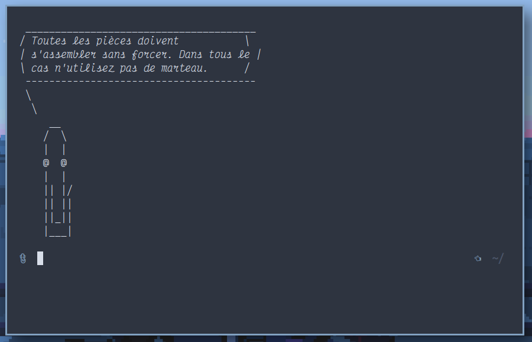

# suckless
My suckless builds with nord colors

https://suckless.org/

## st



## dwm


### Dependencies

- [Victor Mono](https://rubjo.github.io/victor-mono/) font
- [Greenclip](https://github.com/erebe/greenclip)
- Rofi
- st
- slock
- slstatus
- scripts
- numlockx
- unclutter
- xautolock
- dunst
- nitrogen
- maim


## Scripts

Here is a small collection of scripts I like to have on my machines

### Fortune

Some french IT jokes used with `fortune` 

1. copy the `informatique` file in ` /usr/share/games/fortunes/informatique` and edit as your liking
2. run this command to generate the final fortune entry `sudo strfile -c % /usr/share/games/fortunes/informatique /usr/share/games/fortunes/informatique.dat`
3. use it : `fortune informatique`

### Clippy cowsay

A funny clippy version of cowsay

Copy the `clippy.cow` file to ` /usr/share/cowsay/cows/clippy.cow`

You can now use `cowsay -f clippy`


You can even use it in combination with the previous fortune file to display a fun message for every new terminal instance : append the following line in your `.bashrc` or `.zshrc` :

`fortune informatique | cowsay -f clippy`

It will display something like

```
_____________________________________
/ Se tromper est humain ; Vraiment  \
| foutre la merde necessite le mot de |
\ passe de root.                    /
 -------------------------------------
 \
  \
     __
    /  \
    |  |
    @  @
    |  |
    || |/
    || ||
    ||_||
    |___|
```

### Spotify status

In order to get the spotify status in slstatus, copy the `spotify-status.py` script in your path and edit slstatus according to the script path.